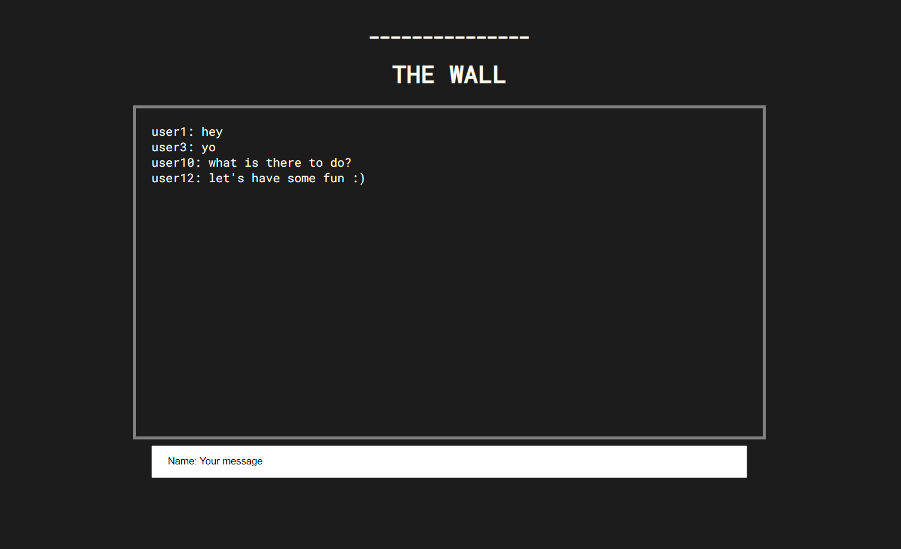

# The Wall

A basic (Bulletin Board System) BBS-like server. It was built with NodeJS and the ExpressJS framework.

# Preview



# How it Works

By default the server starts on localhost:3000. However, it accepts commandline arguments to change the port such as ```node server.js ####``` (replacing #### with the desired port).
The server utilizes the http protocol, using POST requests to get and send responses. The user sends messages through the /send channel and recieves server messages through the /update channel.
To have this server connect to the internet, you set up a port forward on your router, associate a domain name to the ip:port of the server, or use local-tunnel or other programs to connect localhost:port to the internet. 

For local-tunnel, have it installed globally by entering this in the terminal: ```npm install -g localtunnel```.
Afterward, type ```lt --port:####``` into terminal, replacing #### with port desired, and it will give you a link pointing to localhost:####.

If done through port forwarding, you can access the site through http://IP:3000 with IP as in the router's public IPv4 address.

## To Build and Run
1. Have Node.js and npm installed on your system.
2. Clone/Download this repo.
3. Open preferred terminal in the repo directory.
4. Enter 'npm install' into the terminal.
5. After the dependencies from package.json are installed, enter 'npm start' into the terminal.
6. Alternatively you can type 'node server.js' to start the server.
7. Now the site can be accessed via http://localhost:3000.

## File Directory
```
|-README_imgs/
|-express/
	|-css/
		|-style.css		//style for index.html
	|-scripts/
		|-util.js		//javascript to send/recieve input to/from server
	|-index.html		//main page for site
|-package.json			//dependencies for the server
|-server.js				//server entrypoint, handles site requests
|-README.md
```

## Dependencies
This app was made with the following frameworks/packages below. (These dependencies are downloaded in calling 'npm install')
- [NodeJS](http://nodejs.org): Asynchronous event-driven JavaScript runtime enviroment for backend server
- [ExpressJS](http://expressjs.com): A NodeJS framework to resolve http requests/methods